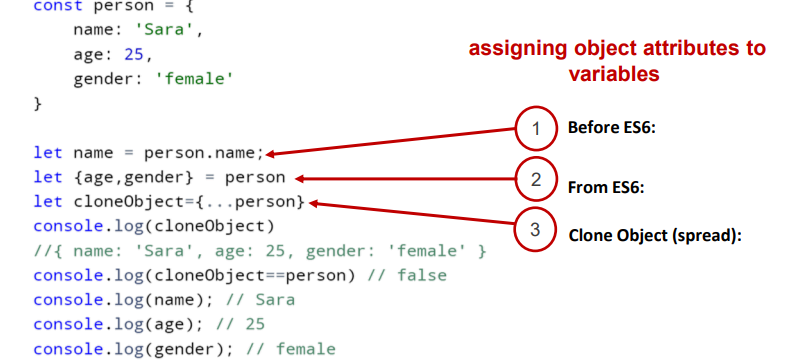

# В JavaScript объект - это отдельная сущность со свойствами и типом. Сравните это, например, с чашкой. Чашка - это объект, обладающий свойствами. Чашка имеет цвет, дизайн, вес, материал , из которого она изготовлена, и т.д. Точно так же объекты JavaScript могут иметь свойства, которые определяют их характеристики. В JavaScript все является объектом.
# В JavaScript-е есть 3 метода:
1.entries()

2.keys()

3.values()

# Синтаксис деструктурирующего присваивания - это выражение JavaScript , которое позволяет распаковывать свойства из объекта в отдельные переменные

# Что такое this в объекте?
this можно писать внутри переменной объекта и также в глобальной области   
this может выбраться из всех областей кроме объекта.
# Whats Date() in Java Script ?

Встречайте новый встроенный объект: Date. Он содержит дату и время, а также предоставляет методы управления ими.

Например, его можно использовать для хранения времени создания/изменения, для измерения времени или просто для вывода текущей даты.

Создать объект Date с временем, равным количеству миллисекунд (тысячная доля секунды), прошедших с 1 января 1970 года UTC+0.

## Fout types of creating Date in JS 

## Metods of of Date in JS 

### 1. now()
### 2. getFullYear()
### 3. getMounth()
### 4. getDate()
### 5. getDay()
### 6. getHours()
### 7. setFullYear()
### 8. setMounth()
### 9. setDate()
### 10. setDay()
### 11. setHours()
